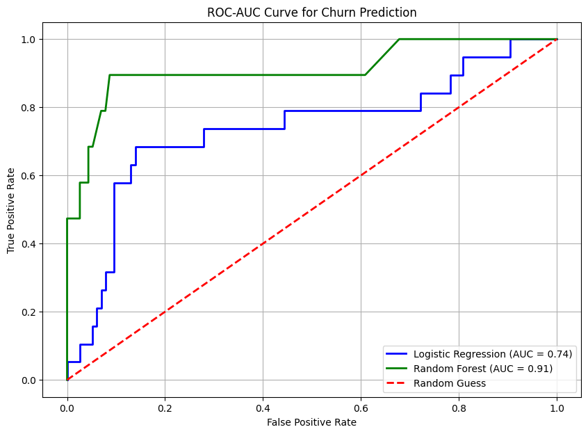
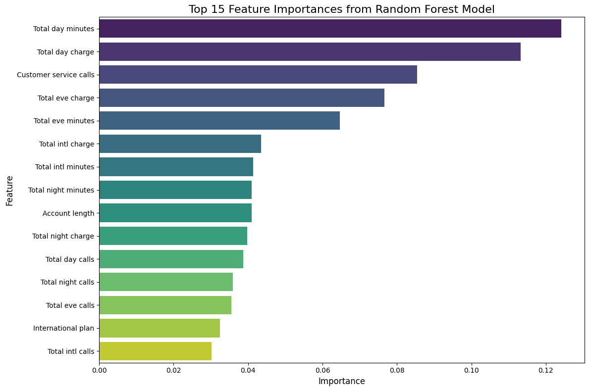

# Customer Churn Prediction — Telecom Analytics

Predicting which telecom customers are likely to churn, using exploratory data analysis, feature engineering, and a comparison of two classification models — with a look at what the results should (and shouldn't) be used for.

## Overview

Customer churn is one of the costliest problems in subscription-based businesses like telecom. This project builds a full pipeline — from raw customer usage data to a trained, evaluated churn classifier — and translates the model's findings into concrete retention recommendations, while also examining the ethical risks of deploying it.

## Dataset

A telecom customer dataset with account-level features: call minutes/charges by time of day (day/eve/night/international), customer service call counts, account length, plan type (international plan, voicemail plan), and state, with `Churn` (yes/no) as the target.

## Methodology

1. **Exploratory Data Analysis** — class balance, correlation heatmap between numeric features, and churn rate by segment.
2. **Feature Engineering** — one-hot encoding for categorical fields (state, plan type), binary conversion for the target and boolean flags, and feature scaling with `StandardScaler`.
3. **Modeling** — two classifiers trained and compared:
   - Logistic Regression (baseline, interpretable)
   - Random Forest (non-linear, ensemble)
4. **Evaluation** — 5-fold cross-validated ROC-AUC on the training set, plus ROC curves and feature importance on a held-out test set.

## Results

| Model | 5-Fold CV ROC-AUC |
|---|---|
| Logistic Regression | 0.7572 (± 0.0620) |
| **Random Forest** | **0.8810 (± 0.0423)** |

Random Forest was both stronger and more consistent across folds, suggesting it captures non-linear patterns in usage behavior that the linear model misses. The same ranking held on the independent test set:



## Key Insights

Feature importance from the Random Forest model highlights what actually drives churn risk:



Daytime usage (minutes and charges) and **customer service call frequency** were the strongest predictors — customers who call support often are meaningfully more likely to churn, which points to support-experience quality as a retention lever, not just pricing.

## Ethical Considerations

A churn model like this can be misused — for example, to justify worse service for customers predicted to stay regardless, or to make automated retention decisions with no human review. Before deploying anything like this in production, it's worth being explicit about:

- **Fairness** — checking the model isn't systematically flagging particular groups (e.g., by state/region) at different rates for reasons unrelated to actual churn risk.
- **Privacy** — usage and call-pattern data is sensitive; access and storage should be minimized and governed.
- **Transparency** — customers affected by retention decisions should be able to understand, at a high level, why they were targeted.
- **Unintended consequences** — using churn scores to *deprioritize* service for "safe" customers would be a misuse of the model's purpose.

## Tech Stack

Python · pandas · scikit-learn (Logistic Regression, Random Forest, cross-validation, ROC-AUC) · Matplotlib · Seaborn

## Running This Project

```bash
pip install pandas scikit-learn matplotlib seaborn jupyter
jupyter notebook customer_churn.ipynb
```

Run all cells top to bottom — the notebook loads the dataset, runs the full pipeline, and reproduces the charts above.
